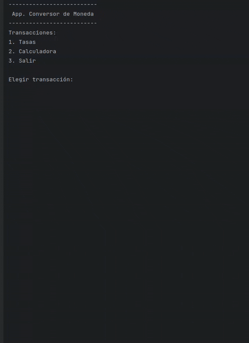
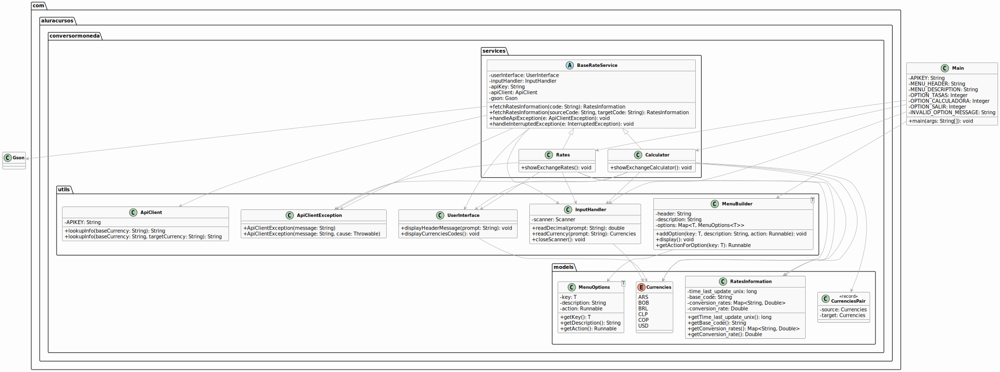

# Conversor de Moneda <!-- omit from toc -->

  

## Índice <!-- omit from toc -->

- [Descripción general](#descripción-general)
- [Diagrama de clases UML](#diagrama-de-clases-uml)
- [Caracterízación](#caracterízación)
- [Tecnologías empleadas](#tecnologías-empleadas)
- [Instalación y ejecución](#instalación-y-ejecución)
- [Funcionamiento](#funcionamiento)
- [Mejoras futuras](#mejoras-futuras)

## Descripción general

Esta aplicación demuestra la comprensión de los principios de la Programación Orientada a Objetos (POO) y las buenas prácticas de desarrollo en Java. La clara separación de responsabilidades, el manejo robusto de errores y el uso de características modernas del lenguaje, contribuyen a una aplicación bien estructurada, mantenible y extensible.

  

## Diagrama de clases UML

  <a href="https://www.plantuml.com/plantuml/png/bLPjJ-Eu4t-VJs7j_yM_gotexjvTXT26j42rG55JJZgTJfLnXcBXs94VsErn-ztFYTrsOhA85H99vlURXncFP_hPMAgjgqLcdhXigAOrOO8Qarkh-RspC6TAblmV8B-ab7CbRMct0iYz4jKWskhz-Xk2SgtLrq89fScKwgSBJRS8FQFiQQELarMW_EzysluXHj6QVatxlVtBiiO3T0Fa0rFrCHLEK-QqKUROv_0C_atNIa95ZsjLWJ0Vo4j624ZdxJgjGJ8EffCHaY_BxdcsE0lFvLNtBAvkmtCHddVbr3-_Pna9QIDBjvHhSdAYWIbTdPv6mqV4AASPJ10p0fRg3TW4GAQlVQYBnd8bpSdgOEy9jXEoYXyL6APvHvgGqcekDn6XB0YNJafwBw0JVoBUunVOZZu64r4oFLZn2B8Ju9n511d3WIwf1JEN3xxUj6NkGxMyXhMdsBLhAazQEyc_JOXG-oZlgO4rKnKaqSSJzCRMkhK-8TUqEGcKCPagvuCu7UPE0emINWs5qQOZ54xpR1VBK0sA9A2MCnpIi8Bd1qwetVUVw5u3-fapYFrBxutrL1jhtmRTrhyCf7tfdTUQImlwWRRDTuS_8uNBnjbBAYi1UaBcw2iIQCDzhw1QH64XE4ZVkFdkDK8RqpRSXVyVo_00bZsctJ72n-shak1lwuRBL20ButYFYdTPVUmIz87FlZ483GyeaRtKMtXMlEffTVNJhh5GzRGJETPFPWKLp0bgbIOlqR9vL5-zadUmWGCy6b8FAGrgTaYgb7R6oRz7HoY47p22bv_gJsTv7Aunq7qvzzsOtyw_pFvCRfLGwiarxHcDsZ4Gn-0M7UAxwQWFtZ23YZbmvBlA3a2Z6epnjTZRV3TpJ1Xrnd-k7lqcR4VdntuS-DeTLWQZKeBsHi9BTAU1LbDWlAPYr6XLDnObMU6Xrp9tXKYfwIRoT2QKWUWhQIEqYyuS5nLel8iUWNe9gl3REqbrmZZCL-Dam-s69wsg81o5LJSUiZX-jU3wLxRYfX5qkyycMMRdIlTy_6YtzGSdUUbRl-pIlmv7djHvC9n3vGjL9LVMEusrfZmqOtflEj7rxEPkVJdBfxFbQ_bqLXRB-UrglhZfWOjEj5xbPLw6WRK1ZP4YlohkhlBfOfaFucL-DL_saVdD7ruuNKV6zQmiyuiPSlk9r3wJ4TKRivF-zNVCkCts_sG9WZAk91W2qcheQWucwofmT7JQ3YFqYQRNNeOw4mbxoomxgBKWQly4INxCfMYwKb8ycGO98mqhmP8DdNNEag2GC8q5GKaO24mYGEB4UR8O-cRVGh7Jb9QwJma3WGmmmi-B39rwAyMJ9CkmbxI4MSz3Ydu6MRbQ_0S0" target="_blank" rel="noopener noreferrer"></a>

## Caracterízación

La organización del programa en el sistema de archivos es la siguiente:

- conversor-moneda
  - src
    - Main.java
    - com
      - aluracursos
        - conversormoneda
          - models
            - Currencies.java
            - CurriencesPair.java
            - MenuOptions.java
            - RatesInformation.java
          - services
            - BaseRateService.java
            - Calculator.java
            - Rates.java
          - utils
            - ApiClient.java
            - ApiClientException.java
            - InputHandler.java
            - MenuBuilder.java
            - UserInterface.java

A su vez, en el proyecto se ponen en práctica los siguientes fundamentos:

1. **Claros principios de diseño orientado a objetos**

- **Encapsulamiento**: Cada clase mantiene su propio estado y comportamiento, exponiendo solo lo necesario a través de métodos públicos. Por ejemplo, `Rates` y `Calculator` gestionan la lógica de obtención y cálculo de tasas, respectivamente, sin exponer directamente los detalles de la API o el manejo de datos.

- **Abstracción**: La clase abstracta `BaseRateService` define el comportamiento común para los servicios relacionados con tasas (obtención de datos de la API, manejo de errores), permitiendo que las clases concretas (`Rates` y `Calculator`) se enfoquen en su lógica específica.

- **Herencia**: Aunque no se ve una herencia directa entre clases concretas, `Calculator` y `Rates` heredan el comportamiento común de `BaseRateService`, promoviendo la reutilización de código y la consistencia.

- **Polimorfismo**: Se observa a través del uso de la interfaz `Runnable` en `MenuBuilder`. Diferentes acciones (mostrar tasas, calculadora, salir) pueden ser asociadas a las opciones del menú y ejecutadas de manera uniforme a través del método `run()`.

2. **Separación de responsabilidades (Single Responsibility Principle)**

- `Main`: Su única responsabilidad es la de inicializar la aplicación, configurar el menú principal y controlar el flujo de la interacción del usuario. No se encarga de la lógica de negocio de las tasas o los cálculos.

- `Rates`: Se encarga específicamente de obtener y mostrar las tasas de cambio.

- `Calculator`: Su responsabilidad es tomar la entrada del usuario y realizar los cálculos de conversión de moneda.

- `ApiClient`: Su única tarea es comunicarse con la API externa para obtener la información necesaria.

- `InputHandler`: Maneja la entrada del usuario de forma segura y con validación.

- `MenuBuilder`: Se dedica a la creación y visualización del menú interactivo.

- `UserInterface`: Proporciona métodos para mostrar mensajes formateados al usuario, manteniendo la presentación separada de la lógica.

- **Clases en el paquete** `models`: Representan las estructuras de datos de la aplicación, como las monedas (`Currencies`), el par de monedas (`CurrenciesPair`), las opciones del menú (`MenuOptions`) y la información de las tasas (`RatesInformation`).

3. **Uso de patrones de diseño implícitos**

- **Factory (Simple Factory)**: Aunque no es un patrón formalmente implementado con una clase factory explícita, la clase `MenuBuilder` actúa como una especie de fábrica para crear y gestionar las opciones del menú y sus acciones asociadas.

- **Strategy**: El uso de `Runnable` para las acciones del menú permite definir diferentes estrategias (las implementaciones de `run()` en los métodos referenciados) que se ejecutan según la selección del usuario.

4. **Robustez y manejo de errores**

- **Validación de la clave de API**: El programa verifica al inicio que la variable de entorno `MI_API_KEY` esté configurada, evitando fallos posteriores por falta de autenticación.

- **Manejo de excepciones de la API**: La clase `ApiClient` implementa un manejo detallado de los posibles errores de la API, proporcionando mensajes informativos basados en el tipo de error recibido (clave inválida, cuota alcanzada, etc.).

- **Manejo de excepciones de entrada**: `InputHandler` utiliza bloques `try-catch` para asegurar que la entrada del usuario sea válida (números decimales positivos y códigos de moneda existentes).

- **Propagación y manejo de** `InterruptedException`: Se maneja la excepción `InterruptedException` al interactuar con la API, asegurando una respuesta adecuada en caso de interrupción del hilo.

5. **Organización y modularidad**

- **Uso de paquetes**: La aplicación está claramente organizada en paquetes (`models`, `services`, `utils`), lo que facilita la comprensión, el mantenimiento y la escalabilidad del código. Cada paquete agrupa clases con responsabilidades relacionadas.

- **Clases pequeñas y enfocadas**: Cada clase tiende a tener una responsabilidad bien definida, lo que hace que el código sea más legible y fácil de probar.

6. **Uso de características avanzadas de Java**:

- **Enums** (`Currencies`): Se utiliza un `enum` para representar los códigos de moneda, lo que garantiza la seguridad de tipos y facilita la gestión de las monedas soportadas.

- **Records** (`CurrenciesPair`): Se utiliza un `record` para representar un par de monedas de forma concisa e inmutable.

- **Lambdas y Referencias a Métodos**: El `MenuBuilder` utiliza referencias a métodos (`rates::showExchangeRates`, `calculator::showExchangeCalculator`) y una lambda (`() -> System.out.println("Saliendo ...")`) para asociar acciones a las opciones del menú, lo que hace que el código sea más conciso y expresivo.

- **StringBuilder**: Se utiliza `StringBuilder` en `MenuBuilder` para construir eficientemente las cadenas del menú.

- `HttpClient`: Se utiliza la API de `HttpClient` introducida en Java 11 para realizar las llamadas HTTP a la API externa.

## Tecnologías empleadas

- Fedora Linux 41 (Workstation Edition)
- openjdk 17.0.15
- IntelliJ IDEA 2025.1.1.1 (Community Edition)
- [ExchangeRate-API](https://www.exchangerate-api.com/)
- [Postman](https://www.postman.com/explore)
- [MvnRepository](https://mvnrepository.com/)
- [Google Gson](https://github.com/google/gson)

## Instalación y ejecución

1. Obtener API Key de [ExchangeRate-API](https://app.exchangerate-api.com/sign-up)

2. Configurar la API Key como variable de entorno de sistema para que el programa pueda ejecutarse correctamente.

3. Clonar en el directorio de descarga este repositorio:

`git clone https://github.com/marcanojuan/conversor-moneda.git`

4. Descargar desde [MvnRepository](https://mvnrepository.com/) la libreria `Gson Ver. 2.13.1`y mover al directorio raiz del proyecto:

`mv gson-2.13.1.jar conversor-moneda`

5. Acceder al directorio raiz del proyecto:

`cd conversor-moneda`

6. Compilar el proyecto:

`javac -cp ".:gson-2.13.1.jar" src/Main.java src/com/aluracursos/conversormoneda/**/*.java -d out`

7. Ejecutar el proyecto compilado:

`java -cp "out:gson-2.13.1.jar" com.aluracursos/conversormoneda.Main`

> _Nota: Todos los comandos son ejecutados bajo GNU/Linux._

## Funcionamiento

El programa es interactivo y basado en un menú. El usuario elige la funcionalidad deseada (ver tasas o calcular conversión) ingresando un número, y luego proporciona la información requerida (monedas base/destino, monto) a través de la consola. La aplicación se encarga de comunicarse con una API externa para obtener los datos necesarios y muestra los resultados al usuario.

## Mejoras futuras

- **Historial de conversiones**: Incorporar la función de registrar y visualizar el historial de las conversiones más recientes, ofreciendo a los usuarios una perspectiva detallada de sus actividades.

- **Soporte para más monedas**: Extender la selección de divisas disponibles para la conversión, posibilitando a los usuarios operar entre un espectro más amplio de opciones monetarias.

- **Registros con marca de tiempo**: Emplear las funcionalidades de la biblioteca `java.time` para generar registros de las conversiones efectuadas, detallando las monedas involucradas y la hora exacta de cada operación.
